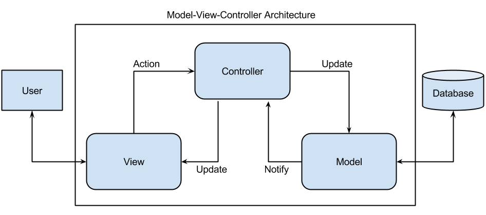

Readme example: [https://gist.github.com/Villanuevand/6386899f70346d4580c723232524d35a](https://gist.github.com/Villanuevand/6386899f70346d4580c723232524d35a)

`#html` `#css` `#js` `#php` `#master-in-software-engineering`

# PHP MVC Pattern Basics <!-- omit in toc -->

> This current repository contains an example of a use case of the MVC pattern.
>
> The main objective of this project is to learn about the MVC pattern both from a conceptual and a practical stand point.

## Index

- [Index](#index)
- [Investigation](#investigation)
- [Built with](#built-with)
- [Contributors ✨](#contributors-)

## Investigation

- What is an architecture pattern?
  > Reusable solution to a commonly occurring problem in software architecture within a given context. The range of issues addressed by architecture patterns  can go from software engineering, such as computer hardware performance limitations, high availability to the minimization of a business risks.
- What is the MVC pattern?
  > MVC Pattern stands for Model-View-Controller Pattern. This pattern is used to separate application's concerns.
  >
  >- **Model**: part of the pattern that carries data and it can also have logic to update controller if its data changes.
  >
  >- **View**: part of the pattern that represents the visualization of the data that model contains.
  >
  >- **Controller**: part of the pattern that acts on both model and view. It controls the data flow into model object and updates the view whenever data changes. It keeps view and model separate.
- Draw a diagram where you understand the MVC pattern clearly.
  
- Explain in which cases you would use this pattern.
  > It is useful for any kind application that requires to have some parts of its UI updated dynamically depending on actions the user takes, specially if those actions entail gathering data from an external source such as a database, which will cause updates in the UI.
- Describe step by step what happens in this pattern from when you create a Request until a Response is returned (you can give more than one example if you consider it necessary).
  
- What advantages do you think this pattern has to use?
  >- Multiple developers can work simultaneously on the model, controller and views.
  >- MVC enables logical grouping of related actions on a controller together. The views for a specific model are also grouped together.
  >- Models can have multiple views.

## Built with

\* HTML

\* CSS

\* JS (jQuery)

\* PHP

## Contributors ✨

👤 [Marc Solà](https://github.com/MarcSola)
