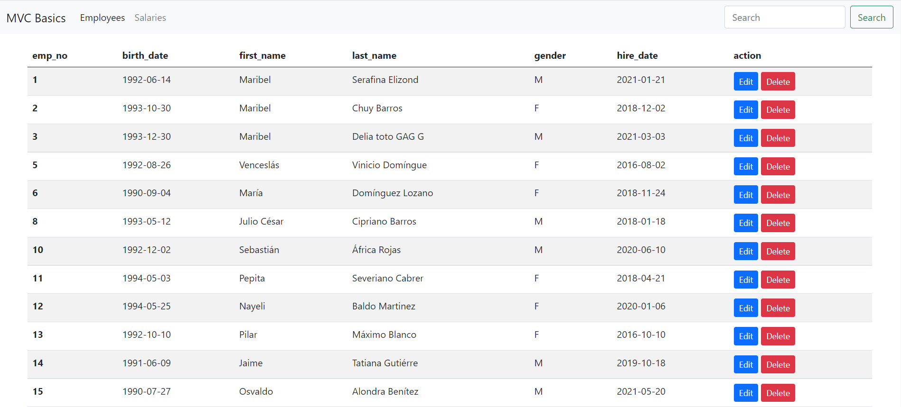
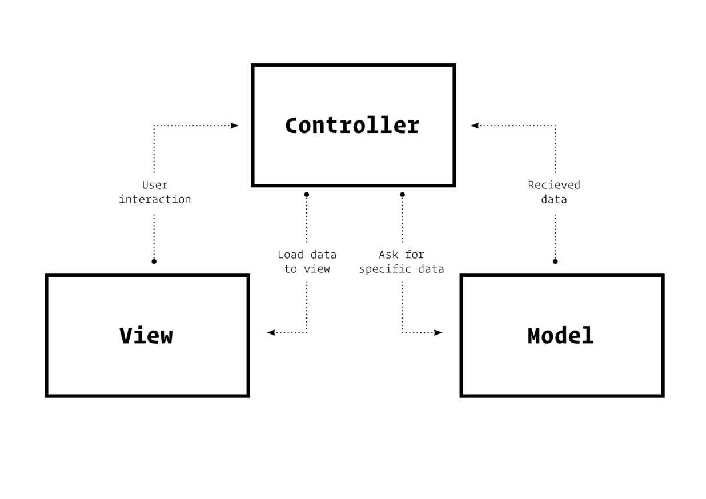

`#html` `#css` `#js` `#php`  `#basics`  `#master-in-software-engineering`
# PHP MVC Basic Patterns<!-- omit in toc -->

This project is a demo created with the MVC pattern using PHP.

<p>
  
</p>

 ### Main objetives:
- Understand what it is an architecture pattern, what it is used for, and what advantages it can bring to the project
- Learn to implement the MVC pattern
- Learn more about the use of this pattern for future implementations in
popular Working Frameworks

## Index <!-- omit in toc -->
## Index <!-- omit in toc -->
- [Theory 📚](#theory-)
- [Where to start?🚀](#where-to-start)
  - [Requirements📋](#requirements)
  - [Install🔧](#install)
- [Deployment📦](#deployment)
- [How to use 💻](#how-to-use-)
  - [Main page](#main-page)
  - [Employees page](#employees-page)
    - [Employee details page](#employee-details-page)
  - [Salaries Page](#salaries-page)
- [Project structure 📁](#project-structure-)
- [Tools and tecnologies used 🛠️](#tools-and-tecnologies-used-️)
- [Project requirements 📏](#project-requirements-)
- [Resources](#resources)

## Theory 📚

**What is an architecture pattern?**

The architectural pattern shows how a solution can be used to solve a reoccurring problem. In another word, it reflects how a code or components interact with each other. Moreover, the architectural pattern is describing the architectural style of our system and provides solutions for the issues in our architectural style.

For example: how to separate the UI of the data module in our architectural style? How to integrate a third-party component with our system? how many tires will we have in our client-server architecture? Examples of architectural patterns are microservices, message bus, service requester/ consumer, MVC, MVVM, microkernel, n-tier, domain-driven design, and presentation-abstraction-control.

***

**What is the MVC pattern?**

MVC is a software architecture pattern, which separates the data and business logic of an application from its representation and the module responsible for managing events and communications. MVC Pattern stands for Model-View-Controller Pattern. This pattern is used to separate application's concerns.

- Model: The model component stores data and its related logic. It represents data that is being transferred between controller components or any other related business logic. It can also have logic to update controller if its data changes.
- View:  View represents the visualization of the data that model contains.
- Controller: Controller acts on both model and view. It controls the data flow into model object and updates the view whenever data changes. It keeps view and model separate.
  
***

**Draw a scheme where you understand that the MVC pattern is clearly**
<p>
    
</p>

***

**Explain in which cases you would use this pattern**

The MVC pattern can always be used on any dynamic web page, it helps to separate the graphical part from the logic behind it. In the case of 100% static pages it may not make much sense to use this pattern.

***

**Describe step by step what happens in this pattern from when you create a Request until a Response is returned (you can give more than one example if you consider it necessary)**

When the user (browser) interacts with our page and takes an action, the request is sent to the server.

The controller takes the event, processes it, and looks up the correct information from the model who's stores the data and supplies the controller and the view of the necessary data.
Once the data is received from the model, the controller, based on the action requested by the user, calls the view (the graphic part) and returns the necessary information that has been requested.

Car driving mechanism is an example of the MVC model. Every car consist of three main parts:
<ul>
    <li><b>View</b>: User interface ( Gear lever, panels, steering wheel, brakeetc.)</li>
    <li><b>Controller</b>: Mechanism ( Engine)</li>
    <li><b>Model</b>: Storage ( Petrol or Diesel tank)</li>
</ul>

***

**What advantages do you think this pattern has to use?**

Here, are major benefits of using MVC architecture:</p>
<ul>
    <li>Easy code maintenance easy to extend and grow</li>
    <li>MVC Model component can be tested separately from the user</li>
    <li>Easier support for new type of clients</li>
    <li>Development of the various components can be performed in a divided way.li>
    <li>It helps you to avoid complexity by dividing an application into the threunits. Model, View, and controller</li>
    <li>It only uses a Front Controller pattern which process web applicatiorequests through a single controller.</li>
    <li>Each part can be tested independently (Model, view, controller)</li>
    <li>It works well for Web apps which are supported by large teams of wedesigners and developers.</li>
    <li>Easier to maintain or modify.</li>
    <li>Search Engine Optimization (SEO) Friendly.</li>
    <li>All classed and objects are independent of each other so that you can testhem separately.</li>
    <li>MVC design pattern allows logical grouping of related actions on controller together.</li>
</ul>

## Where to start?🚀

### Requirements📋

To run this project you need yo have XAMPP installed in your PC (or MUMP in the case of Mac users). For more information about XAMPP visit [their website](https://www.apachefriends.org/es/index.html).

### Install🔧

To clone this repository:

```
git clone https://github.com/mhfortuna/php-mvc-pattern-basics.git
```
Then you need to copy this folder to `htdocs` or change the server root variable.
It's important to import de database to your MySQL installation and change the credentials on `config/db.php`

## Deployment📦

To open the file explorer just open a browser and go to the folder path predicted by [localhost](localhost)

## How to use 💻
### Main page
Here we can choose which controller to use, not much else.
### Employees page
Here we can see all the employees of the database, with their main information. We can also delete employees. We have buttons to go to the "Add employee" page and the "Employee details" page.
#### Employee details page
Here you can see **all** the available data about the selected employee.

### Salaries Page
Here you can see a list of all the company's employees with their salaries. 

## Project structure 📁

```
assets/
config/
controllers/
models/
resources/
views/
```

## Tools and tecnologies used 🛠️

* PHP
* HTML
* Bootstrap 
* MySQL

## Project requirements 📏

- All code included comments need to be write in English
- Use a code style like camelCase
- HTML never use inline styles
- It is recommended to divide the tasks into several subtasks so that you can associate each particular step of the construction with a specific commit
- You should try as much as possible that the commits and planned tasks are the same
 - You must create a correctly documented README.md file in the root directory of the project (see guidelines in Resources)

## Resources

-  [What can PHP do?](https://www.php.net/manual/es/intro-whatcando.php)

-  [XAMPP](https://www.apachefriends.org/es/index.html)

-  [How to install XAMPP on Windows](https://www.youtube.com/watch?v=h6DEDm7C37A)

-  [What is a web server?](https://www.youtube.com/watch?v=Yt1nesKi5Ec)

-  [Web server basics](https://www.youtube.com/watch?v=3VqfpVKvlxQ)