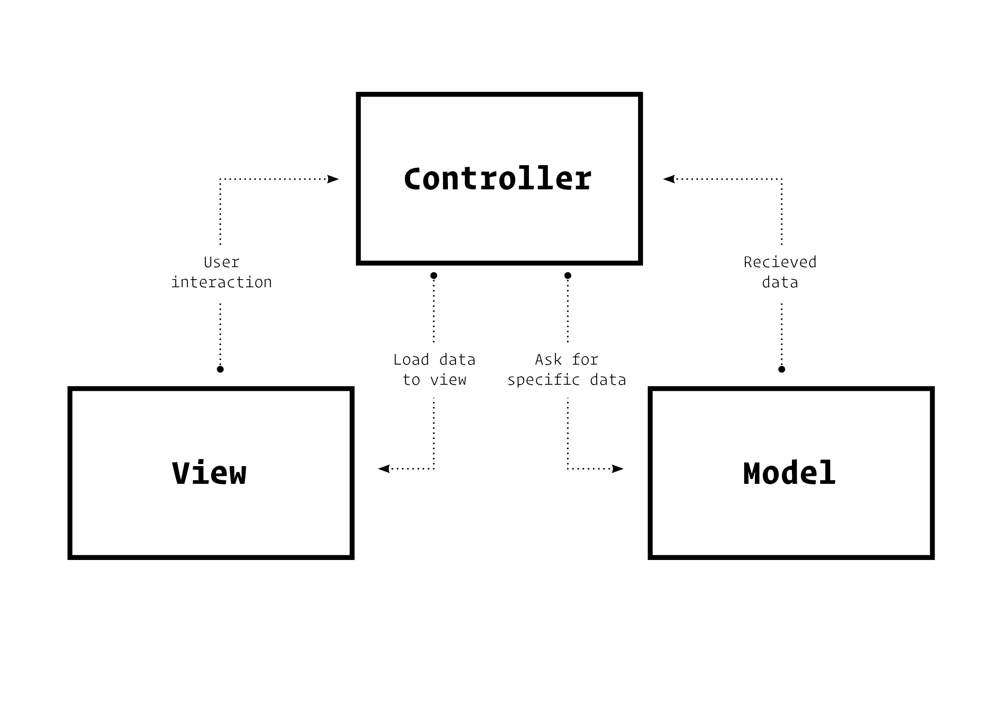

`#html` `#css` `#js` `#php` `#master-in-software-engineering` `#mvc-patter`

# MVC Pattern Basics <!-- omit in toc -->

> This current repository contains an employee manager that uses Manager and Controller PHP files to make API requests and load data to a JSGrid and to forms.

> This app also alows to CRUD (Create Re Update Delete) employees both in Dashboard and Employee's page.

## Index <!-- omit in toc -->

- [Project key points](#project-key-points)
- [Questions](#questions)
- [Directory structure](#directory-structure)
- [Usage](#questions)
  - [Requirements](#requirements)
  - [Install](#clone)
  - [Pages](#pages)
- [Built with](#built-with)
- [Resources](#resources)
- [TODO](#todo)
- [Bugs](#bugs)
- [Contributors](#contributors)

## Project key points

1. Understand what an architecture pattern is and what is it used for.
2. Learn what advantages it can bring to the project.
3. Learn how to implement it.
4. Load data from a MySQL DataBase
5. Controlled user session set to 10 minutes

## Questions

**What is an architecture pattern?**

> It is a way standard way to solve either hardware or software problems designing a structure in which each part of a project relates to another with a giving role.

**What is the MVC pattern?**

> It is a blue print structure that allows developers to design the flow of data through an application. MVC stands for Model View Controller, which are the main roles different files cover in these architectural pattern.
>
> - Controllers: recieve interaction from the user in a view and ask data from models.
> - Models: are in contact with the database and return the data required by the controller.
> - Views: once the controller gets the data, views are rendered (visually) after being called by the a controller method.

**Draw a scheme where you understand that the MVC pattern is clearly**



**Explain in which cases you would use this pattern**

> In all applications that might need to be in contact with a database (such as MySQL) and whenever you will need an scalable application.

**Describe step by step what happens in this pattern from when you create a
Request until a Response is returned (you can give more than one example if
you consider it necessary).**

> 1.  Client **interacts** with UI.
> 2.  A specific method in a **controller** is called and calls an specific model method.
> 3.  This **model** sends a query and returns the result.
> 4.  The result gets to the controller method.
> 5.  Controller requires a new view.

**What advantages do you think this pattern has to use?**

> Mainly scalability but an important thing about MVC is how the standarization of this pattern allows us to work in a more clean and understandable directory structure.

## Directory structure

This directory strcuture establishes the basic archictecture in which the MVC pattern will be exectued in this project.

```bash

repo
 ├── node_modules
 ├── .gitignore
 ├── assets
 ├── config
 ├── resources (queries & initial database)
 ├── models
 │     ├── employeesModel.php
 │     └── departmentsModel.php
 ├── controllers
 │     ├── employeesController.php
 │     └── departmentsController.php
 ├── views
 │     ├── error
 │     ├── main
 │     ├── employees (dashboard & form)
 │     ├── deparments (dashboard & form)
 │     └── head (baisc html head)
 └── index.php (main controller)

```

## Usage

### Requirements

For this project you must have [XAMP](https://www.apachefriends.org/index.html)
or [MAMP](https://www.mamp.info/en/windows/) (better for MacOs systems) installed so that you can start a local server in which execute php files and load data from a database.

You won't need to worry about MySQL interaction since both Apps will provide you this service.

### Installation

First clone this repo in your terminal executing the following instruction (make sure you are cloning this repo inside XAMP/MAMP directory):

```bash
git clone https://github.com/Ricard-Garcia/php-mvc-pattern-basics.git
```

Open XAMP/MAMP server and open the link to your project in your `localhost`.

## Built with

\* HTML

\* CSS

\* JS (jQuery)

\* PHP

\* MySQL

## Resources 👀

### Dependencies

- [Bootstrap](https://getbootstrap.com/)
- [jQuery](https://jquery.com/)

### PHP Docs

- [function_exists()](https://www.php.net/manual/en/function.function-exists.php)
- [call_user_funct()](https://www.php.net/manual/en/function.call-user-func.php)

### Others

- [MAMP](https://www.mamp.info/en/windows/)

## TODO 🤝

- Manage errors entered by URL other than unexistant actions.

## Bugs 🚨

- Departments id are not editable at this moment.

## Contributors ✨

👤 [Ricard Garcia](https://github.com/Ricard-Garcia)
